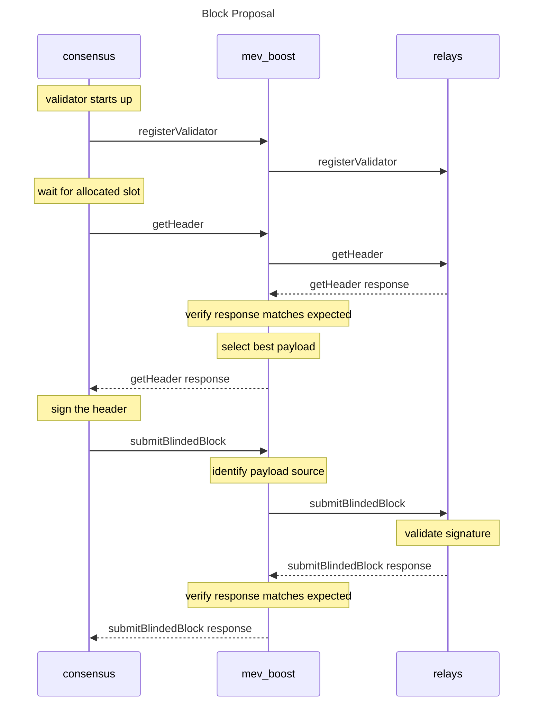

# mev-boost on PulseChain

> [!IMPORTANT]
> **PulseChain operators:** this fork (`Vouchrun/mev-boost`, branch `pulse`) is the PulseChain-compatible mev-boost. Stock flashbots/mev-boost images and releases do **not** work on PulseChain (genesis fork version `0x00000369`, 10-second slots).
>
> - **Setup guide: [ops/README.md](ops/README.md)** - install and run the sidecar with Docker Compose, including the mandatory consensus-client flags
> - Docker image: `ghcr.io/vouchrun/mev-boost:pulse`
> - Relay: `https://boost-relay.vouch.run` · Delivered blocks: `https://boost-relay.vouch.run/mevblocks`

**Quickstart** - run the sidecar with one command (Docker required):

```bash
mkdir -p mev-boost && cd mev-boost && curl -fsSLO https://raw.githubusercontent.com/Vouchrun/mev-boost/pulse/ops/docker-compose.yml && curl -fsSLO https://raw.githubusercontent.com/Vouchrun/mev-boost/pulse/ops/mev-boost-config.example.yaml && docker compose up -d
```

This starts the sidecar only - your beacon node and validator client still
need the builder and gas-limit flags (including the mandatory
`--gas-limit 45000000`); see the [setup guide](ops/README.md).

---

[](https://goreportcard.com/report/github.com/Vouchrun/mev-boost)
[](https://github.com/Vouchrun/mev-boost/actions/workflows/tests.yml)
[](https://github.com/Vouchrun/mev-boost/pkgs/container/mev-boost)

## What is MEV-Boost?

`mev-boost` is open source middleware run by validators to access a competitive block-building market. MEV-Boost is an initial implementation of [proposer-builder separation (PBS)](https://ethresear.ch/t/proposer-block-builder-separation-friendly-fee-market-designs/9725) for proof-of-stake (PoS) Ethereum.

With MEV-Boost, validators can access blocks from a marketplace of builders. Builders produce blocks containing transaction orderflow and a fee for the block proposing validator. Separating the role of proposers from block builders promotes greater competition, decentralization, and censorship-resistance for Ethereum.

## How does MEV-Boost work?

PoS node operators must run three pieces of software: a validator client, a consensus client, and an execution client. MEV-boost is a sidecar for the beacon node - a separate piece of open source software, which queries and outsources block-building to a network of builders. Block builders prepare full blocks, optimizing for MEV extraction and fair distribution of rewards. They then submit their blocks to relays.

Relays aggregate blocks from **multiple** builders in order to select the block with the highest fees. One instance of MEV-boost can be configured by a validator to connect to **multiple** relays. The consensus layer client of a validator proposes the most profitable block received from MEV-boost to the Ethereum network for attestation and block inclusion.

A MEV-Boost security assessment was conducted on 2022-06-20 by [lotusbumi](https://github.com/lotusbumi). Additional information can be found in the [Security](#security) section of this repository.


## Differences from upstream flashbots/mev-boost

- `-pulsechain`: use PulseChain mainnet (genesis fork version `0x00000369`, genesis time `1683785555`, 10-second slots).
- `-relay-keepalive-ms`: relay keep-alive warmer for WAN relays (see [WAN relays and keep-alive](#wan-relays-and-keep-alive)).
- Empty `Eth-Consensus-Version` header on blinded-block submission defaults to Capella (PulseChain is Capella-era with Deneb disabled) - fork commit `6aca5e4`.
- `ops/`: PulseChain reference deployment (Docker Compose + config) for connecting to the Vouch relay.

## Who can run MEV-Boost?

MEV-Boost is a piece of software that any PoS Ethereum node operator (including solo validators) can run as part of their Beacon Client software. It is compatible with any Ethereum consensus client. Support and installation instructions for each client can be found [here](#installing).

---

See also:

* [PulseChain setup guide for validator operators](ops/README.md) - connect a PulseChain validator to the Vouch relay
* Specs:
  * [Builder API](https://ethereum.github.io/builder-specs)

---

# Table of Contents

- [Table of Contents](#table-of-contents)
- [Background](#background)
- [Differences from upstream flashbots/mev-boost](#differences-from-upstream-flashbotsmev-boost)
- [Installing](#installing)
  - [Binaries](#binaries)
  - [From source](#from-source)
    - [Clone and Build](#clone-and-build)
  - [From Docker image](#from-docker-image)
  - [Systemd configuration](#systemd-configuration)
- [Usage](#usage)
  - [Note on usage documentation](#note-on-usage-documentation)
  - [Mainnet](#mainnet)
  - [Sepolia testnet](#sepolia-testnet)
  - [Holesky testnet](#holesky-testnet)
  - [Hoodi testnet](#hoodi-testnet)
  - [PulseChain mainnet](#pulsechain-mainnet)
  - [`test-cli`](#test-cli)
  - [mev-boost cli arguments](#mev-boost-cli-arguments)
    - [`-relays` vs `-relay`](#-relays-vs--relay)
    - [Setting a minimum bid value with `-min-bid`](#setting-a-minimum-bid-value-with--min-bid)
    - [Enabling metrics](#enabling-metrics)
    - [WAN relays and keep-alive](#wan-relays-and-keep-alive)
- [API](#api)
- [Maintainers](#maintainers)
- [Contributing](#contributing)
- [Security](#security)
  - [Audits](#audits)
- [License](#license)

---

# Background

MEV is a centralizing force on Ethereum. Unattended, the competition for MEV opportunities leads to consensus security instability and permissioned communication infrastructure between traders and block producers. This erodes neutrality, transparency, decentralization, and permissionlessness.

Proposer/block-builder separation (PBS) was initially proposed by Ethereum researchers as a response to the risk that MEV poses to decentralization of consensus networks. They have suggested that uncontrolled MEV extraction promotes economies of scale which are centralizing in nature, and complicate decentralized pooling.


In the future, [proposer/builder separation](https://ethresear.ch/t/two-slot-proposer-builder-separation/10980) will be enshrined in the Ethereum protocol itself to further harden its trust model.

Read more in [Why run MEV-Boost?](https://writings.flashbots.net/why-run-mevboost/) and in the [Frequently Asked Questions](https://github.com/flashbots/mev-boost/wiki/Frequently-Asked-Questions).

# Installing

The most common setup is to install MEV-Boost on the same machine as the beacon client. Multiple beacon-clients can use a single MEV-Boost instance. The default port is 18550.

For PulseChain setup, use the [ops/README.md](ops/README.md) guide.

## Binaries

This fork does not publish upstream-style versioned releases. Use the Docker image (below) or build from source.

## From source

Requires [Go 1.24+](https://go.dev/doc/install).

### Clone and Build

```bash
git clone https://github.com/Vouchrun/mev-boost.git
cd mev-boost
git checkout pulse

# Build MEV-Boost
make build

# Show help. This confirms MEV-Boost is able to start
./mev-boost -help
```

## From Docker image

Images for this fork are published to GitHub Container Registry, built from the `pulse` branch:

- [Install Docker Engine](https://docs.docker.com/engine/install/)
- Pull & run:

```bash
# Get the MEV-Boost image
docker pull ghcr.io/vouchrun/mev-boost:pulse

# Run it
docker run ghcr.io/vouchrun/mev-boost:pulse -help
```

## Systemd configuration

You can run MEV-Boost with a systemd config like this:

<details>
<summary><code>/etc/systemd/system/mev-boost.service</code></summary>

```ini
[Unit]
Description=mev-boost
Wants=network-online.target
After=network-online.target

[Service]
User=mev-boost
Group=mev-boost
WorkingDirectory=/home/mev-boost
Type=simple
Restart=always
RestartSec=5
ExecStart=/home/mev-boost/bin/mev-boost \
        -pulsechain \
        -relay-check \
        -relay https://0x8b5d2e73...@boost-relay.vouch.run

[Install]
WantedBy=multi-user.target
```
</details>


# Usage

A single MEV-Boost instance can be used by multiple beacon nodes and validators.

Aside from running MEV-Boost on your local network, you must configure:
* individual **beacon nodes** to connect to MEV-Boost. Beacon Node configuration varies by Consensus client.
* individual **validators** to configure a preferred relay selection. Note: validators should take precautions to only connect to trusted relays.

On PulseChain, point mev-boost at the Vouch relay (`https://boost-relay.vouch.run`) - see the [setup guide](ops/README.md).

## Note on usage documentation

The documentation in this README reflects the `pulse` branch of this fork (`Vouchrun/mev-boost`), including the PulseChain-specific flags. For the setup walkthrough, see [ops/README.md](ops/README.md).

## Mainnet

Run MEV-Boost pointed at a mainnet relay:

```
./mev-boost -relay-check -relay URL-OF-TRUSTED-RELAY
```

## Sepolia testnet

Run MEV-Boost pointed at a Sepolia relay:

```
./mev-boost -sepolia -relay-check -relay URL-OF-TRUSTED-RELAY
```

## Holesky testnet

Run MEV-Boost pointed at a Holesky relay:

```
./mev-boost -holesky -relay-check -relay URL-OF-TRUSTED-RELAY
```

## Hoodi testnet

Run MEV-Boost pointed at a Hoodi relay:

```
./mev-boost -hoodi -relay-check -relay URL-OF-TRUSTED-RELAY
```

## PulseChain mainnet

Run MEV-Boost pointed at a PulseChain relay (the Vouch relay):

```
./mev-boost -pulsechain -relay-check -relay https://<RELAY_PUBKEY>@boost-relay.vouch.run
```

See the [PulseChain setup guide](ops/README.md) for the full setup: consensus-client flags, Docker Compose, verification and rollback.

## `test-cli`

`test-cli` is a utility to execute all proposer requests against MEV-Boost + relay. See also the [test-cli readme](cmd/test-cli/README.md).


## mev-boost cli arguments

These are the CLI arguments for the `pulse` branch of this fork (run `./mev-boost -help` for your build).

```
$ ./mev-boost -help
Usage of mev-boost:
  -addr string
        listen-address for mev-boost server (default "localhost:18550")
  -debug
        shorthand for '-loglevel debug'
  -genesis-fork-version string
        use a custom genesis fork version
  -genesis-timestamp uint
        use a custom genesis timestamp (unix seconds)
  -holesky
        use Holesky
  -hoodi
        use Hoodi
  -json
        log in JSON format instead of text
  -color
        enable colored output for text log format; has no effect if JSON logging is enabled via -json
  -log-no-version
        disables adding the version to every log entry
  -log-service string
        add a 'service=...' tag to all log messages
  -loglevel string
        minimum loglevel: trace, debug, info, warn/warning, error, fatal, panic (default "info")
  -mainnet
        use Mainnet (default true)
  -min-bid float
        minimum bid to accept from a relay [eth]
  -pulsechain
        use PulseChain mainnet
  -relay value
        a single relay, can be specified multiple times
  -relay-check
        check relay status on startup and on the status API call
  -relay-keepalive-ms uint
        interval in ms for keep-alive status requests to each relay (0 disables; keeps the transport warm for low-latency getHeader) (default 30000)
  -relays string
        relay urls - single entry or comma-separated list (scheme://pubkey@host)
  -config string
        path to YAML configuration file for enabling advanced features
  -watch-config
        enable hot reloading of config file (requires -config)
  -request-max-retries int
        maximum number of retries for a relay get payload request (default 5)
  -request-timeout-getheader int
        timeout for getHeader requests to the relay [ms] (default 950)
  -request-timeout-getpayload int
        timeout for getPayload requests to the relay [ms] (default 4000)
  -request-timeout-regval int
        timeout for registerValidator requests [ms] (default 3000)
  -sepolia
        use Sepolia
  -version
        only print version
  -metrics
        enables a metrics server (default: false)
  -metrics-addr string
        listening address for the metrics server (default: "localhost:18551")
```

### `-relays` vs `-relay`

There are two different flags for specifying relays: `-relays` and `-relay`.
The `-relays` flag is a comma separated string of relays. On the other hand,
the `-relay` flag is used to specify a single relay, but can be used multiple
times for multiple relays. Use whichever method suits your preferences.

These two MEV-Boost commands are equivalent:

```
./mev-boost -relay-check \
    -relays $YOUR_RELAY_CHOICE_A,$YOUR_RELAY_CHOICE_B,$YOUR_RELAY_CHOICE_C
```

```
./mev-boost -relay-check \
    -relay $YOUR_RELAY_CHOICE_A \
    -relay $YOUR_RELAY_CHOICE_B \
    -relay $YOUR_RELAY_CHOICE_C
```


### Setting a minimum bid value with `-min-bid`

The `-min-bid` flag allows setting a minimum bid value. If no bid from the builder network delivers at least this value, MEV-Boost will not return a bid
to the beacon node, making it fall back to local block production.

Example for setting a minimum bid value of 0.06 ETH:

```
./mev-boost \
    -min-bid 0.06 \
    -relay $YOUR_RELAY_CHOICE_A \
    -relay $YOUR_RELAY_CHOICE_B \
    -relay $YOUR_RELAY_CHOICE_C
```

### Enabling metrics

Optionally, the `-metrics` flag can be provided to expose a prometheus metrics server. The metrics server address/port can be changed with the `-metrics-addr` (e.g., `-metrics-addr localhost:9009`) flag.

### WAN relays and keep-alive

On a WAN relay path, two independent getHeader timeouts matter:

- `-request-timeout-getheader` - the HTTP client timeout (default **950ms**).
- `timeout_get_header_ms` - the per-request context budget mev-boost actually enforces, `min(timeout_get_header_ms, late_in_slot_time_ms - ms_into_slot)` (default **950ms**). It is configurable **only** via a YAML config file - the CLI flag does not touch it.

Beacon nodes additionally apply a hardcoded **1s** cutoff to builder headers. A cold TLS handshake (~1.2s) exceeds that, so every getHeader times out and the validator silently falls back to local block building. The relay keep-alive warmer (`-relay-keepalive-ms`, default **30000ms**; config-file equivalent `relay_keepalive_ms`; `-relay-keepalive-ms=0` disables) sends periodic status pings so getHeader rides an established connection and answers in ~0.2-0.4s.

See [ops/mev-boost-config.example.yaml](ops/mev-boost-config.example.yaml) for a WAN starting point and [config.example.yaml](config.example.yaml) for the full config-file schema.

### Enable timing games 

The **Timing Games** feature allows `mev-boost` to optimize block proposal by strategically timing `getHeader` requests to relays. Instead of sending a single request immediately, it can delay the initial request and send multiple follow-up requests to capture the latest, most valuable bids before the proposal deadline.

**Notice:** This feature is strictly meant for advanced users and extra care should be taken when setting up timing game associated parameters.

For detailed configuration options, parameters, and visual diagrams, see [docs/timing-games.md](docs/timing-games.md).

---

# API

`mev-boost` implements the latest [Builder Specification](https://github.com/ethereum/builder-specs).



# Maintainers

- [@metachris](https://github.com/metachris)
- [@jtraglia](https://github.com/jtraglia)
- [@ralexstokes](https://github.com/ralexstokes)
- [@terencechain](https://github.com/terencechain)
- [@lightclient](https://github.com/lightclient)
- [@avalonche](https://github.com/avalonche)
- [@Ruteri](https://github.com/Ruteri)

These are the upstream flashbots/mev-boost maintainers. This PulseChain fork is
maintained by the Vouch team.

# Contributing

You are welcome here <3.

- If you have a question, feedback or a bug report for this project, please [open a new Issue](https://github.com/Vouchrun/mev-boost/issues).
- If you would like to contribute with code, check the [CONTRIBUTING file](CONTRIBUTING.md) for further info about the development environment.
- We just ask you to be nice. Read our [code of conduct](CODE_OF_CONDUCT.md).

# Security

To report a vulnerability, open an issue at
https://github.com/Vouchrun/mev-boost/issues. Refer to the
[SECURITY file](SECURITY.md) for details.

## Audits

- [20220620](docs/audit-20220620.md), by [lotusbumi](https://github.com/lotusbumi) - security assessment of the upstream codebase this fork derives from.

# License

The code in this project is free software under the [MIT License](LICENSE).

Logo by [@lekevicius](https://twitter.com/lekevicius) on CC0 license.
